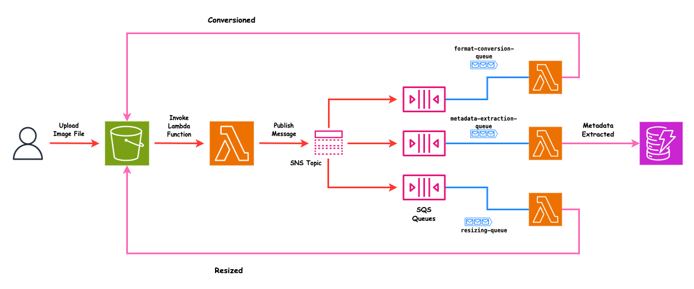

# PixelCascade: Scalable Image Processing Pipeline with AWS Fanout Architecture

PixelCascade is a serverless image processing pipeline built with AWS services, leveraging a fanout architecture. The project enables users to upload images in formats like JPEG, PNG, and GIF, and automates the processing to deliver:

1. **Formatted Images**: Converts images to JPEG format.
2. **Resized Images**: Generates thumbnails, medium, and large-sized images.
3. **Extracted Metadata**: Captures image metadata and stores it in DynamoDB.

## Architecture

## Features

- **Scalable Architecture**: Uses AWS Lambda, S3, SNS, SQS, and DynamoDB to handle high volumes of image uploads without bottlenecks.
- **Automated Workflow**: Processes images through a fanout mechanism with dedicated queues and Lambda functions for each task.
- **Serverless Design**: Fully managed and cost-efficient implementation using AWS services.

## Getting Started

To set up and deploy PixelCascade, follow the [step-by-step guide](https://dev.to/dandipangestu/pixelcascade-building-a-scalable-image-processing-pipeline-with-aws-fanout-architecture-511f) to configure AWS services and Lambda functions.
